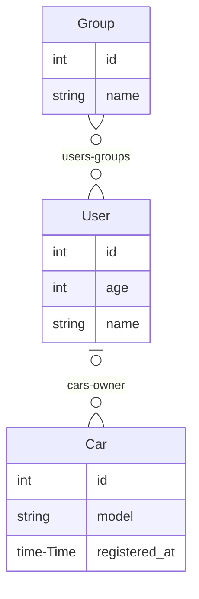

# entmaid

[](https://pkg.go.dev/github.com/troypoulter/entmaid)
[](https://goreportcard.com/report/github.com/troypoulter/entmaid)

A CLI for generating [entity-relationship](https://en.wikipedia.org/wiki/Entity%E2%80%93relationship_model) diagrams in [mermaid.js](https://mermaid.js.org/#/) for the Go entity framework [ent](https://entgo.io/) that can:

- Add the diagram directly inside your `README` or other markdown files.
- (TODO) Create a standalone HTML page for interactive vieiwing.

## Install

To get it like another package run:

```bash
go get -u github.com/troypoulter/entmaid
```

To otherwise install it:

```bash
go install github.com/troypoulter/entmaid
```

## Usage

> **Note**
>
> There are numerous examples you can inspect through the [examples](./examples/) folder and also by inspecting the [Makefile](./Makefile).

```text
A CLI for generating a mermaid.js Entity Relationship (ER) diagram for an Ent Schema, without needing a live database!

Usage:
  entmaid [flags]

Flags:
      --endPattern string       target directory for schemas (default "<!-- #end:entmaid -->")
  -h, --help                    help for entmaid
  -o, --outputType outputType   set the desired output type: can be 'markdown' (useful for GitHub), 'plain' (default markdown)
  -s, --schema string           directory containing the schemas (default "./ent/schema")
      --startPattern string     target directory for schemas (default "<!-- #start:entmaid -->")
  -t, --target string           target file to output diagram (default "./ent/erd.md")
```

1. Start by putting the desired `startPattern` (default: `<!-- #start:entmaid -->`) and `endPattern` (default: `<!-- #end:entmaid -->`) values into your `target` file so `entmaid` knows where to insert the diagram.

2. Run the command passing through all the relevant parameters, this example will be using the command from the [Makefie](./Makefile), `example.readme`:

    ```bash
    entmaid -s ./examples/start/schema -t ./README.md -o markdown --startPattern "<!-- #start:entmaidReadme -->" --endPattern "<!-- #end:entmaidReadme -->"
    ```

3. You should now see the generated diagram in the `target` file, you can check out the diagram below as the above command generated it!

> **Note**
>
> I had to change the pattern slightly so it didn't conflict with the example usage command above.

<!-- #start:entmaidReadme1 -->

<!-- #end:entmaidReadme1 -->

## Inspiration & Acknowledgements

I was inspired by both [a8m/enter](https://github.com/a8m/enter) and [hedwigz/entviz](https://github.com/hedwigz/entviz) for generating mermaid diagrams from reading in just the ent schema folder.

I created this as I also wanted to support `plain` and `markdown` mode, so I could easily generate the diagrams and include directly in technical design documents and ensure it is always up-to-date.

This is also my first publihsed Go module and I wanted to give it a shot!
