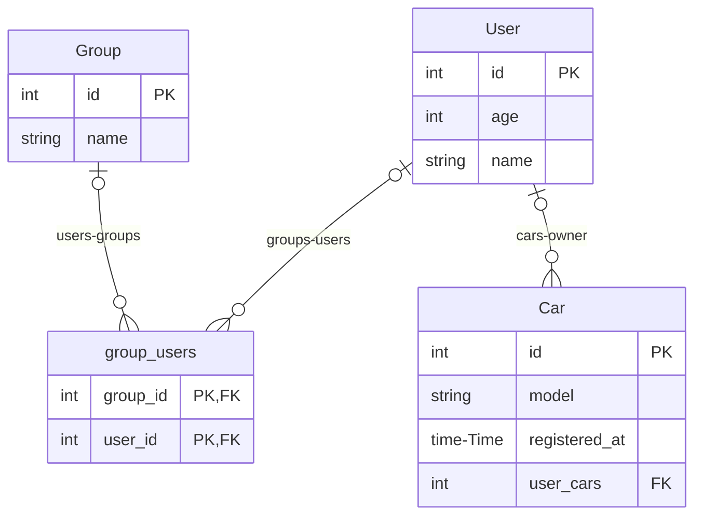

# entmaid

[](https://github.com/troypoulter/entmaid/releases)
[](https://pkg.go.dev/github.com/troypoulter/entmaid)

[](https://codecov.io/gh/troypoulter/entmaid)
[](https://goreportcard.com/report/github.com/troypoulter/entmaid)

A CLI for generating [entity-relationship](https://en.wikipedia.org/wiki/Entity%E2%80%93relationship_model) diagrams in [mermaid.js](https://mermaid.js.org/#/) for the Go entity framework [ent](https://entgo.io/).

## Install

To otherwise install it:

```bash
go install github.com/troypoulter/entmaid@latest
```

## Features

The generated diagram aims to be as SQL like as possible, so it will define:

- **Primary (PK) and Foreign (FK) Keys**: This helps to see how the different relationships are made, especially for foreign keys where if using the standard edges in ent will specify in the schema the actual field name.
- **Display Actual Many-to-Many (M2M) Table**: How ent shows M2M through the default edges approach doesn't make clear that it creates a separate table, so we show you what it actually looks like!

Additional useful features outside of the generated diagram itself:

- **Automatically insert your diagram code into your `README`**: You can support living design documents by having `entmaid` to place the generated diagram inside an existing `README` or any markdown file, so it always stays up-to-date!

Here's an example diagram generated, checkout the [Usage](#usage) section on how it was generated!.

<!-- #start:entmaidReadme1 -->

<!-- #end:entmaidReadme1 -->

## Usage

> **Note**
>
> There are numerous examples you can inspect through the [examples](./examples/) folder and also by inspecting the [Makefile](./Makefile).

```text
A CLI for generating a mermaid.js Entity Relationship (ER) diagram for an Ent Schema, without needing a live database!

Usage:
  entmaid [flags]

Flags:
      --endPattern string       target directory for schemas (default "<!-- #end:entmaid -->")
  -h, --help                    help for entmaid
  -o, --outputType outputType   set the desired output type: can be 'markdown' (useful for GitHub), 'plain' (default markdown)
  -s, --schema string           directory containing the schemas (default "./ent/schema")
      --startPattern string     target directory for schemas (default "<!-- #start:entmaid -->")
  -t, --target string           target file to output diagram (default "./ent/erd.md")
```

1. Start by putting the desired `startPattern` and `endPattern` values into your `target` file so `entmaid` knows where to insert the diagram.

2. Run the command passing through all the relevant parameters, this example will be using the command from the [Makefie](./Makefile), `example.readme`:

    ```bash
    entmaid -s ./examples/start/schema -t ./README.md -o markdown --startPattern "<!-- #start:entmaidReadme -->" --endPattern "<!-- #end:entmaidReadme -->"
    ```

3. You should now see the generated diagram in the `target` file, you can check out the diagram below as the above command generated it!

## Inspiration & Acknowledgements

I was inspired by both [a8m/enter](https://github.com/a8m/enter) and [hedwigz/entviz](https://github.com/hedwigz/entviz) for generating mermaid diagrams from reading in just the ent schema folder.

I created this as I wanted to support additional features (as listed in the [Features](#features) section!), especially being able to insert the generated diagram code _directly_ into my markdown files has been awesome!

This is also my first publihsed Go module and I wanted to give it a shot!
