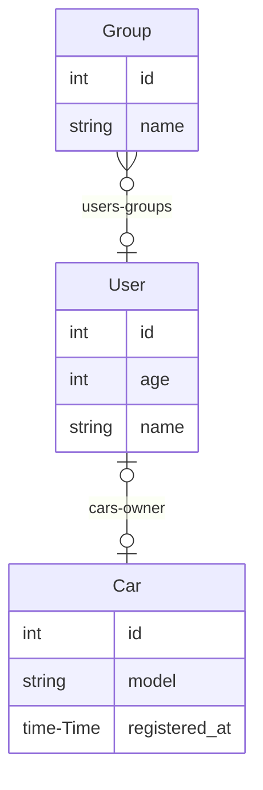

```mermaid
erDiagram
	Car {
		int id
		string model
		time-Time registered_at
	}

	Group {
		int id
		string name
	}

  Group }o--o| User : users-groups
	User {
		int id
		int age
		string name
	}

  User |o--o| Car : cars-owner
```