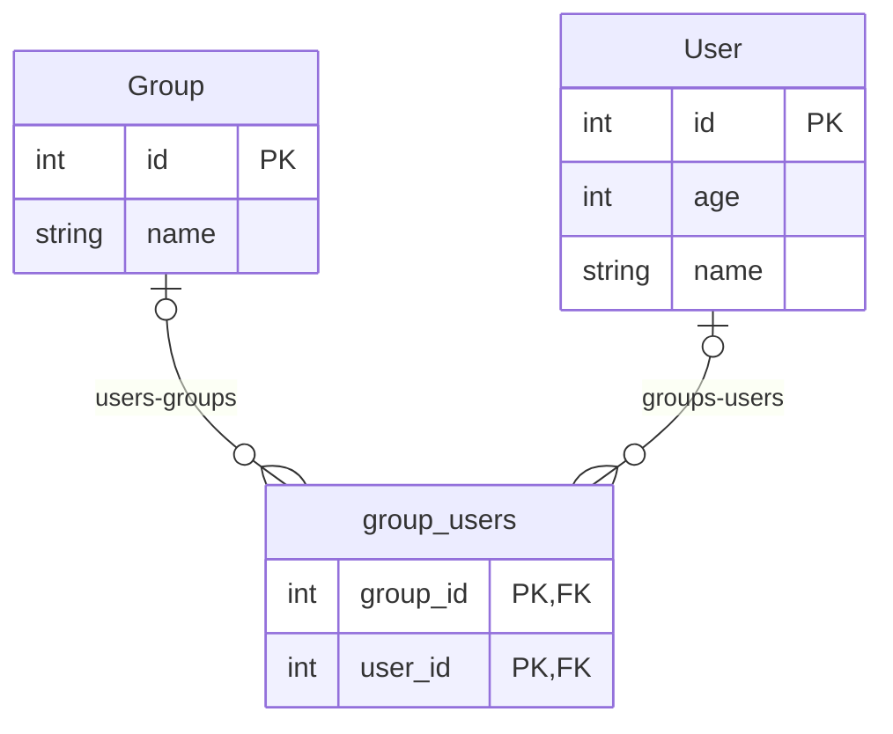

# Edge Schema

Schema taken from: <https://github.com/ent/ent/tree/master/entc/integration/edgeschema>

## Schema

> **Note**
>
> The following schema was generated by `entmaid`.

<!-- #start:entmaid -->

<!-- #end:entmaid -->