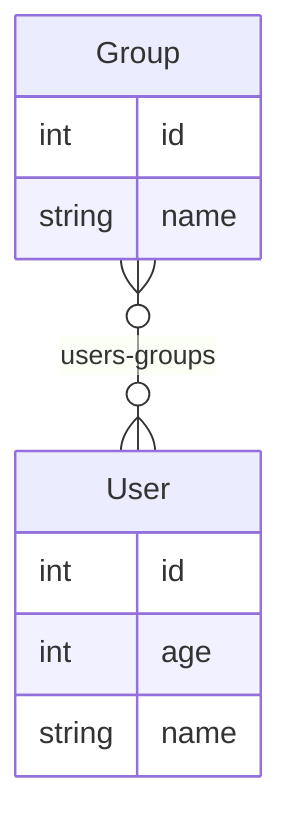

# M2M with Two Types

Schema taken from: https://github.com/ent/ent/tree/master/examples/m2m2types

## Schema

> **Note**
>
> The following schema was generated by `entmaid`.

<!-- #start:entmaid -->

<!-- #end:entmaid -->