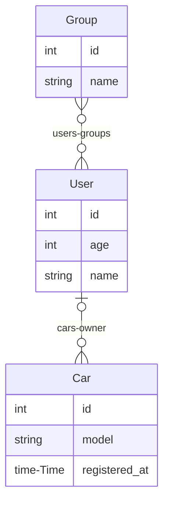

# Starting Example

Schema taken from: <https://github.com/ent/ent/tree/master/examples/start>

## Schema

> **Note**
>
> The following schema was generated by `entmaid`.

<!-- #start:entmaid -->

<!-- #end:entmaid -->